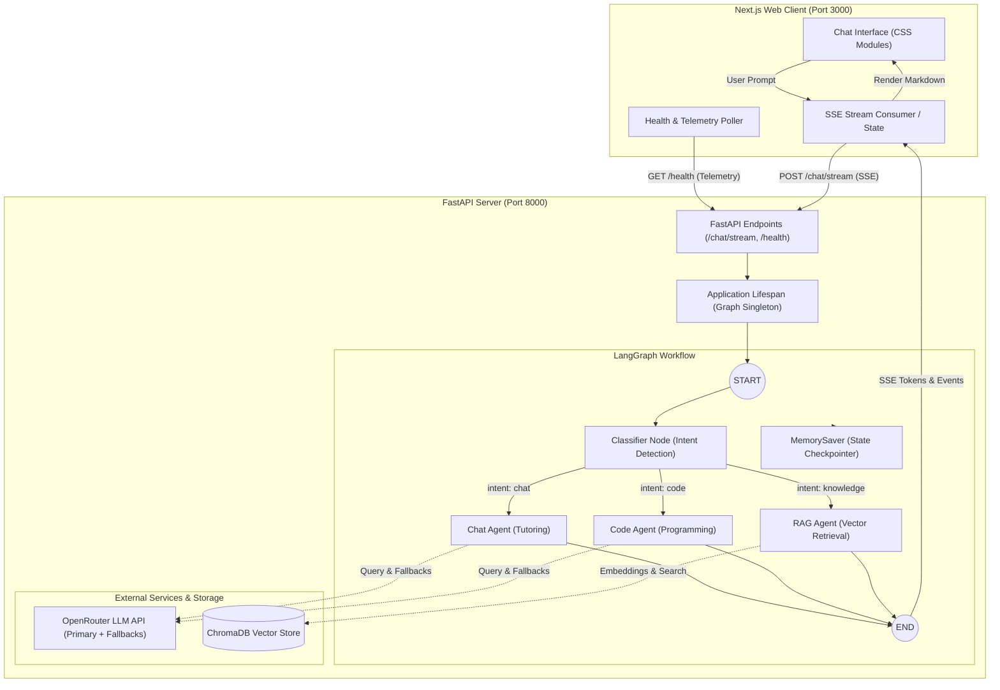

# 🎓 Study Buddy

[](https://fastapi.tiangolo.com)
[](https://langchain-ai.github.io/langgraph/)
[](https://nextjs.org)
[](https://www.typescriptlang.org)
[](https://www.python.org)
[](https://pnpm.io)

**Study Buddy** is a full-stack, multi-agent AI educational assistant. Built as a monorepo featuring a **FastAPI** backend with **LangGraph** multi-agent orchestration, and a modern **Next.js 16** frontend with real-time Server-Sent Events (SSE) token streaming.

---

## ✨ Features

- **🧠 Multi-Agent LangGraph Orchestration**:
  - **Dynamic Intent Classifier**: Classifies incoming queries and routes them to the ideal specialist agent.
  - 💬 **Tutoring & Concept Agent**: Delivers structured explanations, conceptual analogies, and Socratic guidance.
  - ⚡ **Code Specialist Agent**: Synthesizes clean code, analyzes syntax errors, and debugs algorithms.
  - 📚 **Knowledge RAG Agent**: Performs semantic retrieval across indexed study materials and documents using **ChromaDB**.
- **🛡️ Fault-Tolerant LLM Pipeline**:
  - Automatic fallback chain across multiple OpenRouter models (Nemotron, Cohere, Liquid, and more).
  - Configured exponential backoff retry policies for resilience against rate limits or upstream timeouts.
- **⚡ Native Real-Time Streaming (SSE)**:
  - Event-driven communication using FastAPI Server-Sent Events (`POST /chat/stream`).
  - Emits real-time lifecycle events: `session` handshake, classified `intent`, token-by-token `token` stream, and `done` signal.
- **💾 Session & Thread Persistence**:
  - Conversation states checkpointed via LangGraph `MemorySaver` using `thread_id` keys.
  - Persisted client-side across browser sessions in `localStorage`.
- **🎨 Glassmorphic Next.js UI**:
  - Deep obsidian dark theme with CSS Modules and zero external CSS runtime overhead.
  - Syntax-highlighted code blocks with one-click clipboard copying.
  - Streaming generation abort capability via `AbortController`.
  - Live system telemetry monitor tracking backend health, latency, and active LLM models.
- **🧪 Production Monorepo Tooling**:
  - **pnpm workspaces** managing unified scripts and frontend packages.
  - **`uv`** for lightning-fast Python virtual environment and dependency management.
  - Comprehensive Pytest suite with dependency injection overrides and mocked graph flows.
  - Airbnb Extended ESLint and Prettier rules for code quality.

---

## 🏛️ System Architecture



---

## 📁 Repository Structure

```text
study-buddy-langchain/
├── agent/                         # FastAPI & LangGraph Backend
│   ├── src/
│   │   ├── nodes/                 # Specialist agent nodes
│   │   │   ├── chat.py            # Conceptual tutoring agent
│   │   │   ├── classifier.py      # Query intent classifier
│   │   │   ├── code.py            # Code analysis and generation agent
│   │   │   └── rag.py             # ChromaDB vector retrieval agent
│   │   ├── config.py              # LLM models, fallback chains, retry policies
│   │   ├── database.py            # ChromaDB vector store initialization
│   │   ├── graph.py               # LangGraph StateGraph builder & compiler
│   │   ├── schemas.py             # Pydantic request & response models
│   │   └── state.py               # LangGraph state schema definition
│   ├── tests/
│   │   └── test_api.py            # Pytest suite with dependency overrides
│   ├── agent_index.py             # Terminal CLI interactive runner
│   ├── main.py                    # FastAPI application & SSE streaming routes
│   ├── pyproject.toml             # Python dependencies & pyright config
│   └── uv.lock                    # Locked Python dependencies
├── frontend/                      # Next.js 16 Web Application
│   ├── src/
│   │   ├── app/
│   │   │   ├── layout.tsx         # Root layout with fonts & metadata
│   │   │   ├── page.tsx           # Main chat page & agent container
│   │   │   └── globals.css        # Theme variables & glassmorphic resets
│   │   ├── components/            # UI components (Header, MessageList, InputBar, CodeBlock)
│   │   ├── hooks/                 # Custom React hooks (useAgentChat, useServerHealth)
│   │   └── types/                 # TypeScript interfaces for API & chat state
│   ├── package.json               # Frontend dependencies & scripts
│   ├── tsconfig.json              # TypeScript compiler configuration
│   └── next.config.ts             # Next.js runtime configuration
├── package.json                   # Root monorepo workspace configuration
├── pnpm-workspace.yaml            # pnpm workspace definition
└── README.md                      # Project documentation
```

---

## 🚀 Quick Start

### Prerequisites

Ensure you have the following installed:

- **Node.js**: `v20.x` or higher
- **pnpm**: `v9.x` or higher (`corepack enable && corepack prepare pnpm@latest --activate`)
- **Python**: `3.12` or higher
- **uv** (recommended): Fast Python package installer (`curl -LsSf https://astral.sh/uv/install.sh | sh` or `brew install uv`)
- **OpenRouter API Key**: Obtain one from [openrouter.ai](https://openrouter.ai/keys) (free models are supported out of the box)

---

### Step 1: Clone and Install Dependencies

```bash
git clone https://github.com/aaochoa/study-buddy-langgraph.git
cd study-buddy-langchain

# Install monorepo dependencies
pnpm install

# Initialize Python virtual environment and dependencies
cd agent
uv sync
cd ..
```

---

### Step 2: Configure Environment Variables

#### Backend (`agent/.env`)

Copy the sample environment file:

```bash
cp agent/.env.example agent/.env
```

Update `agent/.env` with your OpenRouter key:

```ini
# OpenRouter API Key (Required)
OPENROUTER_API_KEY=sk-or-v1-xxxxxxxxxxxxxxxxxxxxxxxx

# Primary & Fallback LLMs (Default free models preconfigured)
LLM_MODEL=nvidia/nemotron-3-super-120b-a12b:free
LLM_FALLBACK_MODELS=nvidia/nemotron-3.5-lightning:free,nvidia/nemotron-3-ultra-550b-a55b:free,cohere/north-mini-code:free,liquid/lfm-2.5-2.6b:free
LLM_EMBEDDINGS=nvidia/nemotron-3-embed-1b:free
LLM_TEMPERATURE=0.8
LLM_MAX_TOKENS=100000

# Optional: Remote ChromaDB connection (falls back to in-memory store if blank)
CHROMA_HOST=
CHROMA_API_KEY=
CHROMA_TENANT=
CHROMA_DATABASE=
```

#### Frontend (`frontend/.env.local`)

Copy the sample environment file:

```bash
cp frontend/.env.example frontend/.env.local
```

Default configuration:

```ini
NEXT_PUBLIC_AGENT_API_URL=http://localhost:8000
```

---

### Step 3: Run Both Services

From the root directory, run:

```bash
pnpm dev
```

This starts both services concurrently:
- 🟣 **FastAPI Backend**: [http://localhost:8000](http://localhost:8000) (interactive docs at `/docs`)
- 🔵 **Next.js Web UI**: [http://localhost:3000](http://localhost:3000)

---

## 💻 CLI Mode (Terminal Interface)

If you prefer testing the agent directly from the command line:

```bash
cd agent
uv run python agent_index.py
```

Type your questions, and test intent routing without launching the web frontend. Type `exit` or `quit` to end the session.

---

## 🛠️ Workspace Scripts

| Command | Description |
| :--- | :--- |
| `pnpm dev` | Run FastAPI backend and Next.js frontend concurrently |
| `pnpm dev:agent` | Start the FastAPI agent server (`uvicorn` with auto-reload) |
| `pnpm dev:frontend` | Start the Next.js development server |
| `pnpm build:frontend` | Build optimized production bundle for Next.js |
| `pnpm lint:frontend` | Run ESLint across frontend files (Airbnb Extended) |
| `pnpm lint:fix:frontend` | Automatically fix fixable ESLint warnings and errors |
| `pnpm format:frontend` | Format frontend codebase with Prettier |
| `pnpm format:check:frontend`| Check frontend formatting compliance |
| `pnpm test:agent` | Execute the backend Pytest test suite |
| `pnpm install` | Install all dependencies across the workspace |

---

## 🔌 API Endpoints

### 1. `GET /health`
Returns system status, active primary model, and all fallback models.

```bash
curl -X GET http://localhost:8000/health
```

**Response (`200 OK`)**:
```json
{
  "status": "ok",
  "primary_model": "nvidia/nemotron-3-super-120b-a12b:free",
  "all_configured_models": [
    "nvidia/nemotron-3-super-120b-a12b:free",
    "nvidia/nemotron-3.5-lightning:free",
    "nvidia/nemotron-3-ultra-550b-a55b:free",
    "cohere/north-mini-code:free",
    "liquid/lfm-2.5-2.6b:free"
  ]
}
```

---

### 2. `POST /chat`
Executes synchronous graph invocation and returns the completed response.

```bash
curl -X POST http://localhost:8000/chat \
  -H "Content-Type: application/json" \
  -d '{
    "message": "Explain quicksort algorithm with time complexity",
    "thread_id": "optional-custom-uuid"
  }'
```

**Response (`200 OK`)**:
```json
{
  "response": "Quicksort is an efficient, divide-and-conquer sorting algorithm...",
  "thread_id": "optional-custom-uuid",
  "intent": "code",
  "model_used": "nvidia/nemotron-3-super-120b-a12b:free"
}
```

---

### 3. `POST /chat/stream` (Server-Sent Events)
Streams tokens in real-time as LangGraph nodes execute.

```bash
curl -N -X POST http://localhost:8000/chat/stream \
  -H "Content-Type: application/json" \
  -d '{"message": "How does photosynthesis work?"}'
```

**Stream Event Flow**:
```text
event: session
data: {"thread_id": "a90df7f2-1b15-46aa-bd52-87000dcf50df"}

event: intent
data: {"intent": "chat"}

event: token
data: {"token": "Photosynthesis"}

event: token
data: {"token": " is"}

...

event: done
data: {"status": "completed", "thread_id": "a90df7f2-1b15-46aa-bd52-87000dcf50df"}
```

---

## 🧪 Testing

The backend test suite uses Pytest with FastAPI's `TestClient` and tests dependency-injected graph execution and streaming validation:

```bash
# Run tests via root workspace
pnpm test:agent

# Or directly in agent directory
cd agent
uv run pytest -v
```

Tests cover:
- ✅ Server health check and model registry response
- ✅ Pydantic schema validation (e.g., rejecting empty input with 422)
- ✅ End-to-end chat endpoint using mock graph dependency injection
- ✅ Real-time SSE streaming format (`session`, `intent`, `token`, `done` events)

---

## ⚙️ Configuration Reference

### Backend (`agent/.env`)

| Variable | Type | Default | Description |
| :--- | :--- | :--- | :--- |
| `OPENROUTER_API_KEY` | String | *Required* | API key for OpenRouter LLM requests |
| `LLM_MODEL` | String | `nvidia/nemotron-3-super-120b-a12b:free` | Primary model for chat & code tasks |
| `LLM_FALLBACK_MODELS`| Comma-separated | Nemotron / Cohere / Liquid free models | Failover list if primary model is rate-limited |
| `LLM_EMBEDDINGS` | String | `nvidia/nemotron-3-embed-1b:free` | Embedding model for vector knowledge store |
| `LLM_TEMPERATURE` | Float | `0.8` | LLM temperature parameter |
| `LLM_MAX_TOKENS` | Integer | `100000` | Maximum token limit for responses |
| `CORS_ORIGINS` | Comma-separated | `http://localhost:3000,http://localhost:5173...` | Allowed CORS origins for browser security |
| `CHROMA_HOST` | String | *Optional* | ChromaDB remote server host |

### Frontend (`frontend/.env.local`)

| Variable | Type | Default | Description |
| :--- | :--- | :--- | :--- |
| `NEXT_PUBLIC_AGENT_API_URL` | String | `http://localhost:8000` | Base URL of the FastAPI backend server |

---

## 📄 License

This project is licensed under the [MIT License](LICENSE).
