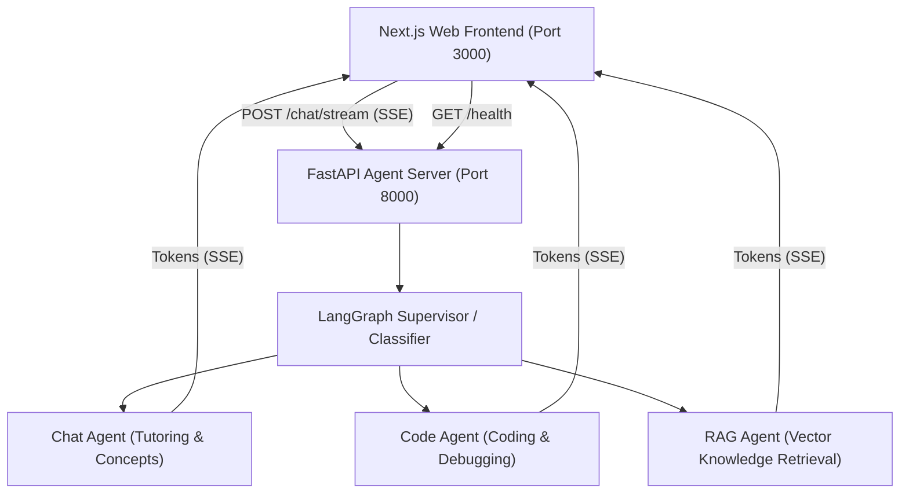

# Study Buddy LangChain & Next.js Monorepo

Study Buddy is a full-stack, multi-agent educational assistant powered by **FastAPI**, **LangChain / LangGraph**, and **Next.js**.

## Architecture Overview



## Project Structure

- `agent/`: FastAPI application using LangGraph multi-agent orchestration, SQLite checkpointing, and vector RAG retrieval.
- `frontend/`: Next.js 16 (App Router + TypeScript + CSS Modules) interface with real-time SSE streaming.

## Quick Start

### Run Both Applications Simultaneously (Recommended)

From the project root:

```bash
pnpm dev
```

This uses `concurrently` to start:
- 🟣 **FastAPI Agent**: `http://localhost:8000` (auto-reloading with `uv`)
- 🔵 **Next.js Web UI**: `http://localhost:3000`

### Workspace Scripts

- `pnpm dev` - Start both backend and frontend concurrently
- `pnpm dev:agent` - Run only the FastAPI server
- `pnpm dev:frontend` - Run only the Next.js app
- `pnpm build:frontend` - Build production Next.js bundle
- `pnpm lint:frontend` - Lint the frontend code (Airbnb Extended)
- `pnpm format:frontend` - Format frontend code with Prettier
- `pnpm format:check:frontend` - Validate Prettier formatting
- `pnpm test:agent` - Run backend pytest suite
- `pnpm install` - Install all workspace dependencies
