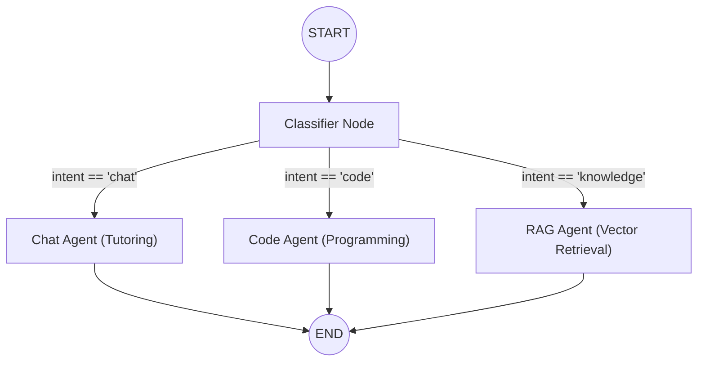

# 🤖 Study Buddy Agent (FastAPI + LangGraph)

The backend engine for **Study Buddy**, providing multi-agent orchestration, intent classification, Server-Sent Events (SSE) streaming, and ChromaDB vector retrieval.

---

## Architecture & Workflow

The agent uses a compiled **LangGraph** `StateGraph` backed by an in-memory checkpointer (`MemorySaver`).



### Specialist Nodes

1. **`classifier`** ([classifier.py](file:///Users/anderson/Documents/development/study-buddy-langchain/agent/src/nodes/classifier.py)): Analyzes incoming query and outputs structured intent (`chat`, `code`, or `knowledge`).
2. **`chat_agent`** ([chat.py](file:///Users/anderson/Documents/development/study-buddy-langchain/agent/src/nodes/chat.py)): Socratic study tutor providing step-by-step conceptual breakdowns and explanations.
3. **`code_agent`** ([code.py](file:///Users/anderson/Documents/development/study-buddy-langchain/agent/src/nodes/code.py)): Code assistant providing syntax-safe code snippets, algorithm breakdowns, and debugging tips.
4. **`rag_agent`** ([rag.py](file:///Users/anderson/Documents/development/study-buddy-langchain/agent/src/nodes/rag.py)): Vector retrieval node querying **ChromaDB** with embeddings for context-grounded answers.

---

## Resilience & Model Fallbacks

Defined in [config.py](file:///Users/anderson/Documents/development/study-buddy-langchain/agent/src/config.py):
- **Model Fallbacks**: Configured with `ChatOpenRouter.with_fallbacks(...)` so if the primary model fails or is rate-limited, requests automatically cascade to alternate models.
- **Retry Policies**: Graph nodes attach `RetryPolicy(max_attempts=3, backoff_factor=2.0)` to handle transient network hiccups.

---

## Local Development & Setup

### 1. Install Dependencies with `uv`

```bash
cd agent
uv sync
```

### 2. Configure Environment

```bash
cp .env.example .env
```

Set your `OPENROUTER_API_KEY` in `.env`.

### 3. Run FastAPI Development Server

```bash
uv run uvicorn main:app --reload --port 8000
```

- API Docs: [http://localhost:8000/docs](http://localhost:8000/docs)
- Health Check: [http://localhost:8000/health](http://localhost:8000/health)

### 4. Interactive CLI Mode

Test the multi-agent graph directly in your terminal without starting a web server:

```bash
uv run python agent_index.py
```

---

## Running Tests

```bash
uv run pytest -v
```
